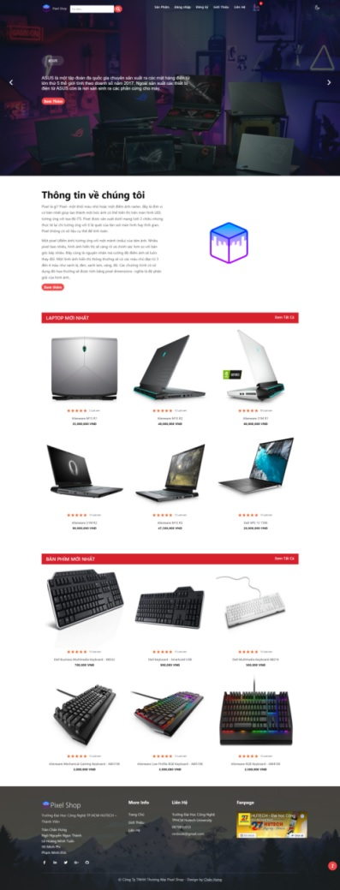
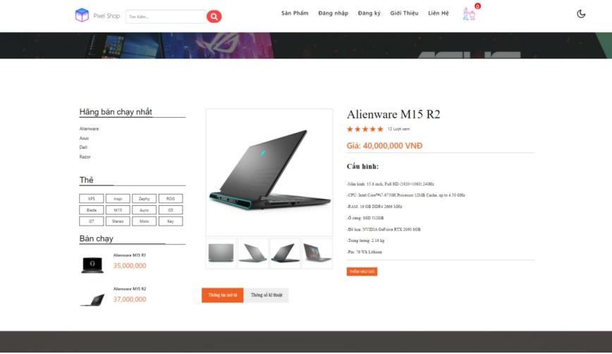
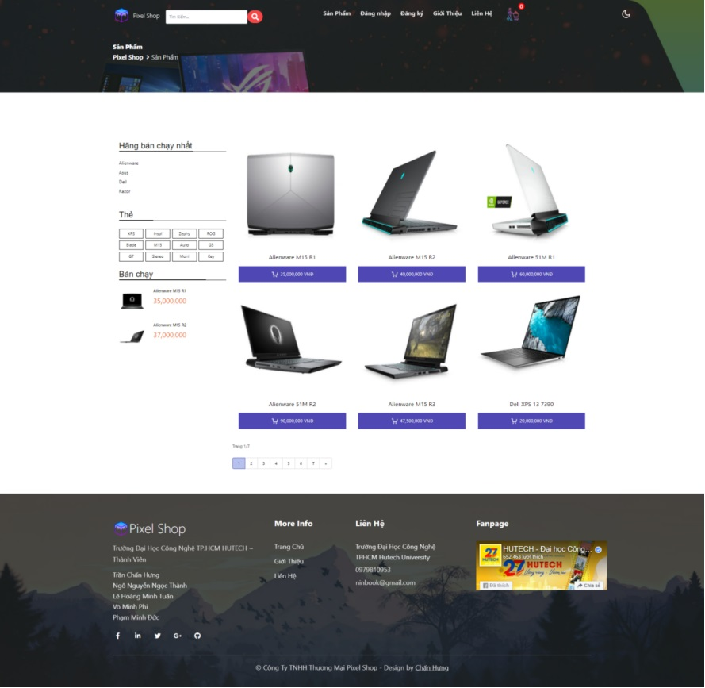
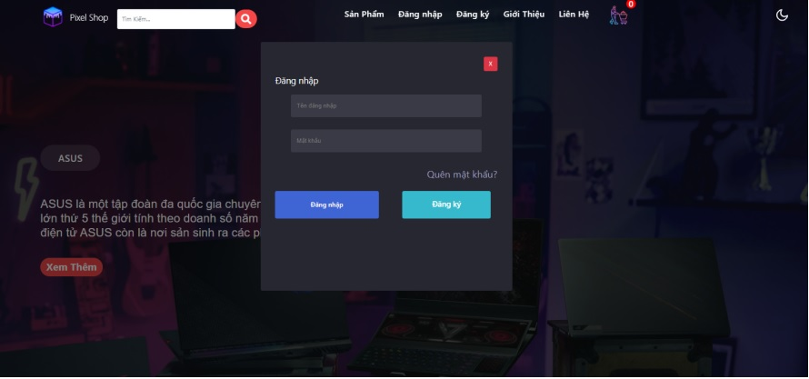
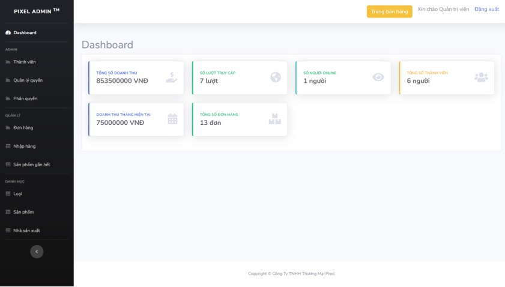
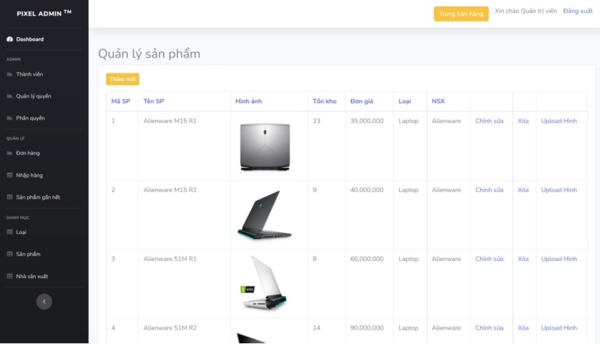

# 🔥🔥 Pixel Ecommerce Shop

Pixel Ecommerce Shop is a website that allows customers to purchase products and services through an online platform. These stores are similar to traditional brick-and-mortar shops, with the main difference being that customers can shop from the comfort of their own homes, without having to physically visit a store.

Star⭐ the repo if you like what you see😉.

## Features

- Add cart, delete and edit cart details, order.
- Register, login.
- Display product list by type, by manufacturer.
- Statistics data.
- Authorization and rights management.
- Account management.
- Order management.
- Manage incoming goods and products that are out of stock.
- Product management, product type, manufacturer.

*Sorry I'm too lazy to translate so just that's it🤣

## Screenshots

 
 
 
 

* Admin Panel:

 
 

## Technology
- C# Language
- ASP.NET MVC
- MSSQL Server

## Author(s)

License from Team Pixel 

Stt | Mã sinh viên | Tên
---- | ---- | ---
1 | 1911065247 | [Trần Chấn Hưng](https://www.facebook.com/chanhung.ninzy/)
2 | 1911160680 | [Ngô Nguyễn Ngọc Thành](https://www.facebook.com/dong.ngo.77770/)
3 | 1911065880 | [Lê Hoàng Minh Tuấn](https://www.facebook.com/cuabequyen/)

